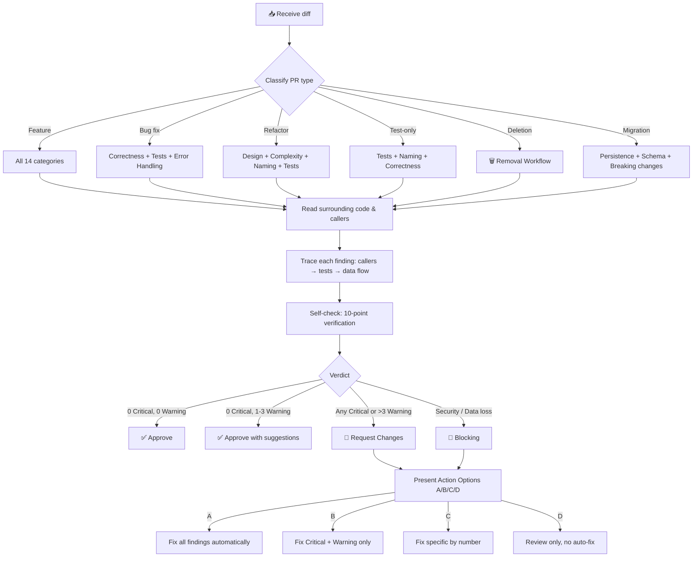
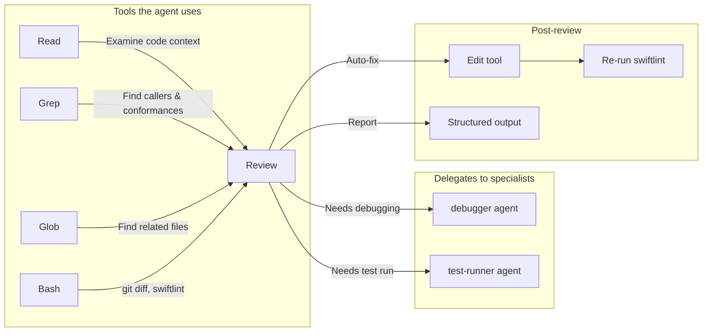

<div align="center">

# 🔍 Code Reviewer Agent for iOS

**Automated code review for Swift & SwiftUI projects**

*A Claude Code subagent that reviews your iOS code like a senior engineer, giving concrete fixes instead of vague suggestions*

[](https://docs.anthropic.com/en/docs/agents)
[]()
[]()
[](LICENSE)

[Features](#-what-it-reviews) · [How It Works](#-how-it-works) · [Examples](#-example-output) · [Built On](#-built-on)

```bash
mkdir -p .claude/agents && curl -o .claude/agents/code-reviewer.md \
  https://raw.githubusercontent.com/Hesoyam07/code-review-agent-for-ios/main/code-reviewer.md
```

---

</div>

## 🎯 The Problem

You finish a feature, push the code, and get a review that says:

> *"Consider improving the error handling here."*

No specifics. No fix. No file path. You're left guessing what exactly to change. Or worse — the review nitpicks import order while missing a force unwrap on API data at line 42.

## 💡 The Solution

**Code Reviewer Agent** is a `.md` file that configures Claude Code for expert-level iOS code review. It gives you the exact fix: file, line, before → after.

```
Services/APIService.swift:42:critical: [Swift] Force unwrap on API response data.
Fix: guard let data = response.data else { throw APIError.missingData }
```

Every finding has a severity, confidence level, and a concrete code change.

## ⚡ Why This Agent

<table>
<tr>
<td>

```
✅ 14 review categories
✅ 14 false-positive rules
✅ 4 severity levels + confidence
✅ Auto-fix with A/B/C/D options
✅ 0 dependencies, 0 config
✅ 1 file, copy and use
✅ Bilingual output (EN + RU)
✅ 8 refactoring heuristics
```

</td>
<td>

| Feature | This Agent | Manual Review | Generic AI |
|:--------|:----------:|:------------:|:----------:|
| Concrete fixes (file:line) | ✅ | ✅ | ❌ |
| Security (OWASP Mobile Top 10) | ✅ | ⚠️ sometimes | ❌ |
| False-positive filtering | ✅ | ✅ | ❌ |
| Auto-apply fixes | ✅ | ❌ | ❌ |
| Consistent across PRs | ✅ | ❌ | ⚠️ varies |
| Available at 3 AM | ✅ | ❌ | ✅ |
| Cost | Free | $150+/hr | Free |
| Setup time | 30 seconds | — | — |

</td>
</tr>
</table>

## ✨ What It Reviews

<table>
<tr>
<td width="50%" valign="top">

### Code Quality
- 🏗️ **Design & Architecture** — SOLID violations, layer leaks, MVVM misuse
- ✅ **Correctness** — force unwraps, optionals, API contract mismatches
- 🧩 **Complexity** — 11 code smells with thresholds (Fowler)
- 📝 **Naming** — Swift API Design Guidelines conventions
- 🔷 **Swift** — `Any` hunting, value vs reference types, retain cycles

</td>
<td width="50%" valign="top">

### Reliability & Security
- ⚡ **Swift Concurrency** — data races, actor isolation, Task cancellation
- 🔒 **Security** — OWASP Mobile Top 10, Keychain, ATS, supply chain
- 🚨 **Error Handling** — silent catch, try!, missing user-facing errors
- 📱 **SwiftUI Patterns** — @Observable, property wrappers, view lifecycle
- ♿ **Accessibility** — VoiceOver, Dynamic Type, 44pt tap targets

</td>
</tr>
<tr>
<td width="50%" valign="top">

### Testing & Data
- 🧪 **Test Quality** — XCTest, Swift Testing, coverage gaps, async tests
- 🗃️ **Persistence** — SwiftData/Core Data migrations, thread safety
- 📦 **Performance** — main thread blocking, SwiftUI re-renders, image handling

</td>
<td width="50%" valign="top">

### Developer Experience
- 📋 **Comments & Docs** — WHY not WHAT, no dead code
- 🗑️ **Removal Workflow** — safe deletion verification
- 🔄 **Refactoring Heuristics** — when to suggest vs. when to skip

</td>
</tr>
</table>

**14 review categories total.** The agent only checks what's relevant. Networking PR? It skips SwiftUI and Accessibility. Test-only PR? It focuses on assertions and isolation.

## 📊 How It Works



## 🎚️ Four Severity Levels

The key question: **"Can you describe a scenario where a real user is harmed?"**

| Level | Meaning | Example |
|:------|:--------|:--------|
| 🔴 **Critical** | Users **will** be affected. Immediate harm | Force unwrap on API data, tokens in UserDefaults, main thread deadlock, retain cycle |
| 🟡 **Warning** | Users **may** be affected under conditions | Missing Task cancellation, no `[weak self]` in closure, data race |
| 🔵 **Suggestion** | Dev experience issue. Code works but could be better | Extract large function, use struct instead of class, add accessibility label |
| ⚪ **Nit** | Purely cosmetic | SwiftUI modifier ordering, import sort order, property declaration order |

Each finding includes **confidence level**: `[HIGH]` (verified), `[MEDIUM]` (likely), `[LOW]` (suspicious).

## 📦 Installation

### 1. Copy the agent file

```bash
# Create agents directory if it doesn't exist
mkdir -p .claude/agents

# Download the agent
curl -o .claude/agents/code-reviewer.md \
  https://raw.githubusercontent.com/Hesoyam07/code-review-agent-for-ios/main/code-reviewer.md
```

### 2. Use it

```bash
# In Claude Code, say:
"Review my recent changes"
"Check this code before I push"
"глянь код, нет ли косяков?"
```

No configuration, API keys, or build step required.

> **Requirements:** [Claude Code](https://docs.anthropic.com/en/docs/claude-code) with subagent support. The agent runs on `sonnet` model by default.

## 📋 Example Output

```
## Code Review
**Scope:** 4 files, 142 lines | **Verdict:** Request Changes

### 🔴 Critical (must fix)
1. **[Correctness] [HIGH]** `Services/APIService.swift` L42:
   Force unwrap on API response — will crash if server returns unexpected format.
   Fix:
   // Before
   let estimate = response.data!
   // After
   guard let estimate = response.data else { throw APIError.missingData }

2. **[Security] [HIGH]** `Services/AuthService.swift` L18:
   Auth token stored in UserDefaults — accessible without encryption.
   Fix: Use Keychain via KeychainWrapper.set(token, forKey: "authToken")

### 🟡 Warning
1. **[Swift Concurrency] [MEDIUM]** `ViewModels/EstimateViewModel.swift` L55:
   Missing [weak self] in escaping closure — potential retain cycle.
   Fix: { [weak self] result in guard let self else { return } ... }

### 🔵 Suggestion
1. **[Swift]** `Models/EstimateModel.swift` L8:
   Using class where struct is more appropriate — no inheritance, no identity needed.

### ⚪ Nit
1. **[Naming]** `ViewModels/EstimateViewModel.swift` L12:
   `let d = Date()` → `let createdAt = Date()`

### ✅ Good
- Clean MVVM separation — Views contain no business logic
- Proper use of async/await throughout the networking layer
- @Observable with @MainActor on ViewModels — correct pattern

### Next Steps
> Recommended: **A. Fix all** (2 Critical issues must be resolved before merge)
> - A. Fix all — auto-apply all fixes
> - B. Fix blocking — Critical + Warning only
> - C. Fix specific — choose by number
> - D. Review only — no auto-fix
```

## 🧠 Key Design Decisions

### "Review the diff, not the file"

The agent reviews only what changed, not the entire codebase. Pre-existing issues in unchanged code are out of scope. This follows [Google's Engineering Practices](https://google.github.io/eng-practices/review/): approve when the change improves overall code health, even if imperfect.

### "Investigate before judging"

Every finding is verified by reading the actual code. The agent uses `Grep` to find callers and protocol conformances, `Read` to check implementations, and traces the data flow before writing a fix. A review based on assumptions breaks trust.

### Smart skipping

14 false-positive rules prevent noise: `@IBOutlet` force unwraps, `@objc`/`dynamic` for UIKit interop, `@MainActor` on ViewModels, force unwraps in tests, `AnyView` in `#Preview`, and more.

### Bilingual (EN + RU)

The agent detects the user's language and outputs the entire review in that language: headings, severity labels, and fixes. Code stays in Swift.

## 🔧 Under the Hood



### Memory System

The agent has persistent memory across review sessions. It learns:
- Your project's coding conventions
- Recurring patterns and known false positives
- Team preferences not captured in config files

```
code-reviewer: project uses @Observable → flag @ObservedObject as deprecated pattern
code-reviewer: navigation via UINavigationController wrapper → don't suggest NavigationStack
code-reviewer: API timeout is 300s intentionally → don't flag as too long
```

### Refactoring Intelligence

Not every code smell warrants a suggestion. The agent uses **8 heuristics** to decide:

1. **Rule of Three** — tolerate duplication until the third occurrence
2. **Change frequency** — refactor hot spots, not stable code
3. **Blast radius** — >5 callers = separate task, not PR comment
4. **Behavior preservation** — no tests? Suggest tests first
5. **Incremental delivery** — never "rewrite the module"
6. **Wrong abstraction** — duplication > wrong abstraction (Sandi Metz)
7. **Test-first** — refactoring without tests is gambling
8. **Scope boundary** — refactoring belongs in a dedicated PR

## 📚 Built On

Built on practices from established industry sources:

| Source | What it contributes |
|:-------|:-------------------|
| [Google Engineering Practices](https://google.github.io/eng-practices/review/) | Review philosophy, severity calibration |
| Robert C. Martin — *Clean Code* | SOLID, naming, functions |
| Martin Fowler — *Refactoring* | 11 code smells with thresholds |
| Sandi Metz — *Practical OOP* | Wrong abstraction principle |
| Steve McConnell — *Code Complete* | Construction, defensive programming |
| [OWASP Mobile Top 10](https://owasp.org/www-project-mobile-top-10/) | Mobile security checklist |
| [Swift API Design Guidelines](https://www.swift.org/documentation/api-design-guidelines/) | Naming conventions, argument labels |
| [Apple HIG](https://developer.apple.com/design/human-interface-guidelines/) | Accessibility, tap targets, Dynamic Type |

## 🗂️ Repository Structure

```
code-review-agent-for-ios/
├── code-reviewer.md    # the agent (copy to .claude/agents/)
├── README.md
└── LICENSE
```

One file. No build step. No dependencies. Copy and use.

## 🏗️ Origin

This agent is a fork of [code-review-agent](https://github.com/SomeStay07/code-review-agent) by [SomeStay07](https://github.com/SomeStay07), originally built for TypeScript + React projects. It has been fully rewritten for iOS development with Swift and SwiftUI-specific categories, OWASP Mobile Top 10 security checks, Swift Concurrency patterns, and iOS false-positive rules.

> *830+ lines of review logic adapted for iOS. Every rule targets real Swift/SwiftUI issues — from retain cycles to data races to force unwraps on API data.*

## 🤝 Contributing

1. Fork this repo
2. Edit `code-reviewer.md`
3. Test by placing it in your project's `.claude/agents/` directory
4. Submit a PR with a description of what changed and why

### Agent file structure

```
name: code-reviewer
description: Expert code reviewer for Swift/SwiftUI iOS projects
tools: [Read, Edit, Grep, Glob, Bash, Task, Write]
model: sonnet

## Language Rule
## Identity
## Review Rules
## Review Process / Workflow
## Categories (14)
## Severity Calibration
## False-Positive Rules
## Self-check (10 items)
## Output Format
## References
```

## 📄 License

[MIT](LICENSE) — use it, modify it, ship it.

---

<div align="center">

**Built for iOS developers who want concrete code reviews.**

*If this helped you, give it a ⭐ — it helps others find it too.*

</div>
