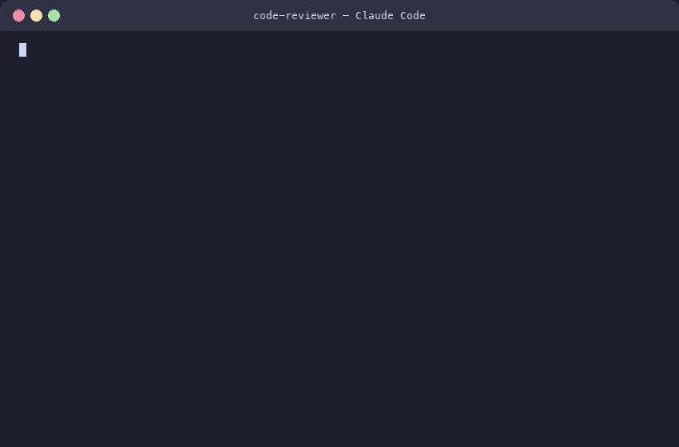
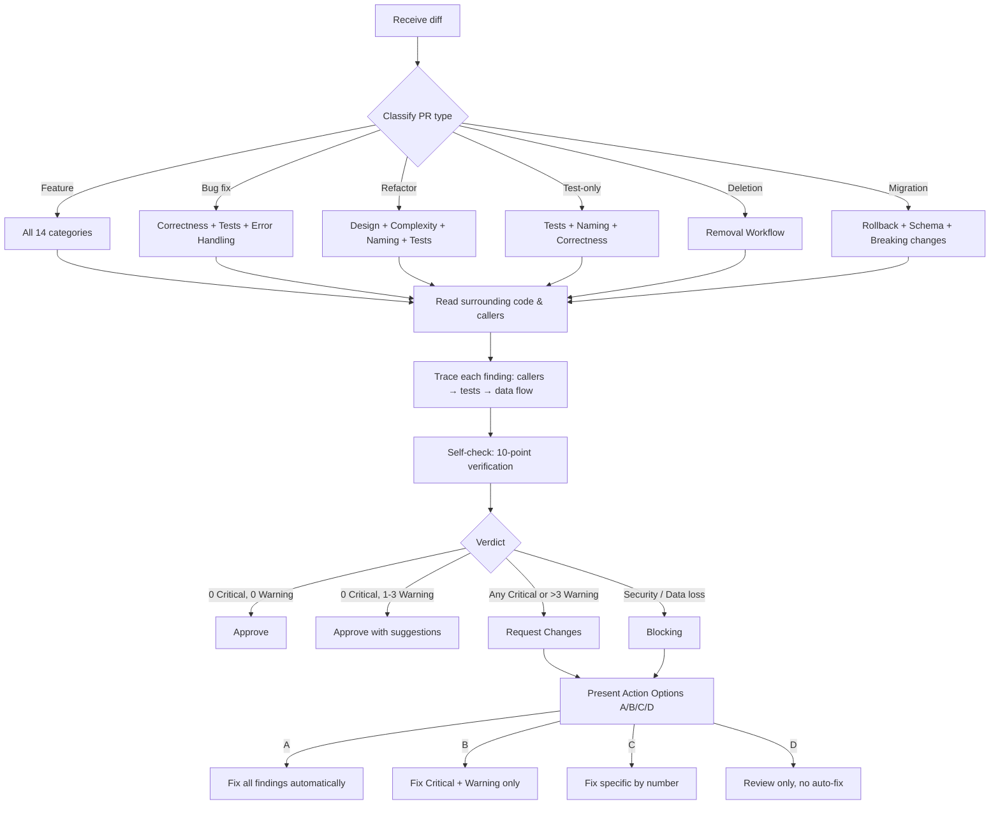

<div align="center">

# Code Reviewer Agent

**Automated code review for TypeScript & React projects**

*A Claude Code agent that reviews your code like a senior engineer — concrete fixes instead of vague suggestions*

[](https://code.claude.com/docs)
[](https://www.typescriptlang.org/)
[](https://react.dev/)
[](LICENSE)
[](https://t.me/codeonvibes)

[What It Reviews](#what-it-reviews) · [How It Works](#how-it-works) · [Installation](#installation) · [Example Output](#example-output) · [Built On](#built-on)

```bash
mkdir -p .claude/agents && curl -o .claude/agents/code-reviewer.md \
  https://raw.githubusercontent.com/SomeStay07/code-review-agent/main/code-reviewer.md
```

---

</div>

## The Problem

You finish a feature, push the code, and get a review that says:

> *"Consider improving the error handling here."*

No specifics. No fix. No file path. You're left guessing what exactly to change. Or worse — the review nitpicks import order while missing a SQL injection on line 42.

## What This Does

**Code Reviewer Agent** is a single `.md` file that turns [Claude Code](https://code.claude.com/docs) into an expert code reviewer. Drop it into `.claude/agents/` and get reviews with exact fixes: file, line, before → after.

> **What's a Claude Code agent?** An agent is a `.md` file in `.claude/agents/` that gives Claude Code specialized behavior for a specific task. No plugins, no API keys — just a text file with instructions. [Learn more](https://code.claude.com/docs)

```
src/api/userController.ts:42:critical: [Security] Raw user input in SQL query.
Fix: db.query('SELECT * FROM users WHERE id = $1', [userId])
```

Every finding has a severity, confidence level, and a concrete code change.

<div align="center">
<br>

<br>
<sub>What a review looks like — real findings, real fixes, no fluff</sub>
<br><br>
</div>

## At a Glance

- 14 review categories with smart scoping per PR type
- 14 false-positive rules to reduce noise
- 4 severity levels with confidence scoring
- Auto-fix with A/B/C/D options after each review
- 8 refactoring heuristics (Rule of Three, blast radius, etc.)
- Responds in your language — detects and adapts automatically
- 0 dependencies, 0 config — one file, copy and use

| Feature | This Agent | Manual Review | Generic AI |
|:--------|:----------:|:------------:|:----------:|
| Concrete fixes (file:line) | ✅ | ✅ | ❌ |
| Security (OWASP Top 10) | ✅ | ⚠️ sometimes | ❌ |
| False-positive filtering | ✅ | ✅ | ❌ |
| Auto-apply fixes | ✅ | ❌ | ❌ |
| Consistent across PRs | ✅ | ❌ | ⚠️ varies |
| Setup time | 30 seconds | — | — |

## What It Reviews

<table>
<tr>
<td width="50%" valign="top">

### Code Quality
- **Design & Architecture** — SOLID violations, layer leaks, wrong abstractions
- **Correctness** — edge cases, API contract mismatches, schema drift
- **Complexity** — 11 code smells with thresholds (Fowler)
- **Naming** — Clean Code conventions
- **TypeScript** — `any` hunting, type safety, discriminated unions

</td>
<td width="50%" valign="top">

### Reliability & Security
- **Async & Concurrency** — race conditions, TOCTOU, N+1 queries
- **Security** — OWASP Top 10, supply chain, CORS, headers
- **Error Handling** — silent failures, missing boundaries
- **React Patterns** — hooks, stale closures, re-renders
- **Accessibility** — semantic HTML, ARIA, keyboard navigation

</td>
</tr>
<tr>
<td width="50%" valign="top">

### Testing & Data
- **Test Quality** — coverage gaps, meaningful assertions
- **DB Migrations** — rollback safety, schema alignment
- **Performance** — bundle size, lazy loading, memoization

</td>
<td width="50%" valign="top">

### Developer Experience
- **Comments & Docs** — WHY not WHAT, no dead code
- **Removal Workflow** — safe deletion verification
- **Refactoring Heuristics** — when to suggest vs. when to skip

</td>
</tr>
</table>

**14 review categories total.** The agent only checks what's relevant. Backend PR? It skips React and a11y. Test-only PR? It focuses on assertions and isolation.

## How It Works



## Severity Levels

The key question: **"Can you describe a scenario where a real user is harmed?"**

| Level | Meaning | Example |
|:------|:--------|:--------|
| **Critical** | Users **will** be affected. Immediate harm | SQL injection, missing auth check, data corruption |
| **Warning** | Users **may** be affected under conditions | Missing useEffect cleanup, cognitive complexity >15 |
| **Suggestion** | Dev experience issue. Code works but could be better | Extract shared logic, use discriminated unions |
| **Nit** | Purely cosmetic | Better variable name, import order |

Each finding includes **confidence level**: `[HIGH]` (verified), `[MEDIUM]` (likely), `[LOW]` (suspicious).

## Installation

### Option A: One command (recommended)

```bash
mkdir -p .claude/agents && curl -o .claude/agents/code-reviewer.md \
  https://raw.githubusercontent.com/SomeStay07/code-review-agent/main/code-reviewer.md
```

### Option B: Manual

1. Download [`code-reviewer.md`](https://raw.githubusercontent.com/SomeStay07/code-review-agent/main/code-reviewer.md)
2. Place it in your project's `.claude/agents/` directory

### Use it

```bash
# In Claude Code, say:
"Review my recent changes"
"Check this code before I push"
"глянь код, нет ли косяков?"
```

No configuration, API keys, or build step required.

> **Requirements:** [Claude Code](https://code.claude.com/docs) with agent support. The agent runs on `sonnet` model by default.

## Example Output

```
## Code Review
**Scope:** 4 files, 187 lines | **Verdict:** Request Changes

### Critical (must fix)
1. **[Correctness] [HIGH]** `src/services/orderService.ts` L42:
   Frontend expects `Order[]`, but API returns `{ data: Order[], total: number }`.
   Will crash at runtime.
   Fix: `const orders = response.data` (not `const orders = response`)

2. **[Security] [HIGH]** `src/api/userController.ts` L18:
   Raw user input in SQL query — SQL injection.
   Fix: `db.query('SELECT * FROM users WHERE id = $1', [userId])`

### Warning
1. **[React] [MEDIUM]** `src/components/OrderList.tsx` L25:
   useEffect subscribes to eventBus but no cleanup. Memory leak on unmount.
   Fix: `return () => eventBus.unsubscribe(handler)`

### Suggestion
1. **[TypeScript]** `src/types/order.ts` L8:
   String literal union → use discriminated union for exhaustive matching

### Nit
1. **[Naming]** `src/services/orderService.ts` L12:
   `const d = new Date()` → `const createdAt = new Date()`

### Good
- Clean separation between API layer and business logic
- Proper use of discriminated unions for OrderStatus
- All new functions have descriptive names

### Next Steps
> Recommended: **A. Fix all** (2 Critical issues must be resolved before merge)
> - A. Fix all — auto-apply all fixes
> - B. Fix blocking — Critical + Warning only
> - C. Fix specific — choose by number
> - D. Review only — no auto-fix
```

## Key Design Decisions

### "Review the diff, not the file"

The agent reviews only what changed, not the entire codebase. Pre-existing issues in unchanged code are out of scope. This follows [Google's Engineering Practices](https://google.github.io/eng-practices/review/): approve when the change improves overall code health, even if imperfect.

### "Investigate before judging"

Every finding is verified by reading the actual code. The agent uses `Grep` to find callers, `Read` to check implementations, and traces the data flow before writing a fix. A review based on assumptions breaks trust.

### Smart skipping

14 false-positive rules prevent noise: NestJS DI injection, `any` in tests, `as` assertions in mocks, barrel re-exports, root component `useEffect` cleanup, and more.

### Language detection

The agent detects the user's language and outputs the entire review in that language: headings, severity labels, and fixes. Code stays in the programming language.

## Internals

### Memory System

The agent has persistent memory across review sessions. It learns:
- Your project's coding conventions
- Recurring patterns and known false positives
- Team preferences not captured in config files

```
code-reviewer: team uses barrel re-exports → don't flag as dead code
code-reviewer: formatCurrency() required for all price display → flag raw .price access
```

### Refactoring Intelligence

Not every code smell warrants a suggestion. The agent uses **8 heuristics** to decide:

1. **Rule of Three** — tolerate duplication until the third occurrence
2. **Change frequency** — refactor hot spots, not stable code
3. **Blast radius** — >5 callers = separate task, not PR comment
4. **Behavior preservation** — no tests? Suggest tests first
5. **Incremental delivery** — never "rewrite the module"
6. **Wrong abstraction** — duplication > wrong abstraction (Sandi Metz)
7. **Test-first** — refactoring without tests is gambling
8. **Scope boundary** — refactoring belongs in a dedicated PR

## Built On

| Source | What it contributes |
|:-------|:-------------------|
| [Google Engineering Practices](https://google.github.io/eng-practices/review/) | Review philosophy, severity calibration |
| Robert C. Martin — *Clean Code* | SOLID, naming, functions |
| Martin Fowler — *Refactoring* | 11 code smells with thresholds |
| Sandi Metz — *Practical OOP* | Wrong abstraction principle |
| Steve McConnell — *Code Complete* | Construction, defensive programming |
| [OWASP Top 10](https://owasp.org/www-project-top-ten/) | Security checklist |
| [Kent C. Dodds](https://kentcdodds.com/blog) | React patterns, hooks, testing |

## Repository Structure

```
code-review-agent/
├── assets/
│   ├── demo.gif        # animated terminal demo (looped)
│   └── demo.svg        # static terminal preview
├── code-reviewer.md    # the agent (copy to .claude/agents/)
├── README.md
└── LICENSE
```

One file. No build step. No dependencies. Copy and use.

## Troubleshooting

| Issue | Cause | Fix |
|-------|-------|-----|
| Agent not triggered | File missing or wrong path | Verify `.claude/agents/code-reviewer.md` exists in your project |
| Review is too slow | Large diff with many files | Agent auto-scopes, but you can say "focus on security only" |
| False positive | Rule doesn't match your codebase | Say "this is intentional" — agent learns via memory |
| No review output | Older Claude Code version | Run `claude --version` and update to latest |

## Contributing

1. Fork this repo
2. Edit `code-reviewer.md`
3. Test by placing it in your project's `.claude/agents/` directory
4. Submit a PR with a description of what changed and why

### Agent file structure

```
---
name: code-reviewer
description: |
  What the agent does.
  USE THIS AGENT WHEN: ...
  Technical triggers: ...
tools: Read, Grep, Glob, Bash, ...
model: sonnet
---

## Language Rule
## Core Principle
## Rules
## Review Process / Workflow
## Categories / Checks
## Severity Calibration
## Self-check
## Output Format
## Sources
```

## See Also

**[Claude Memory Skill](https://github.com/SomeStay07/claude-memory-skill)** — persistent project memory for Claude Code. Remembers your decisions, catches contradictions, cleans up stale context. Pairs well with this reviewer: the memory skill stores project conventions, and the reviewer enforces them.

## License

[MIT](LICENSE) — use it, modify it, ship it.
