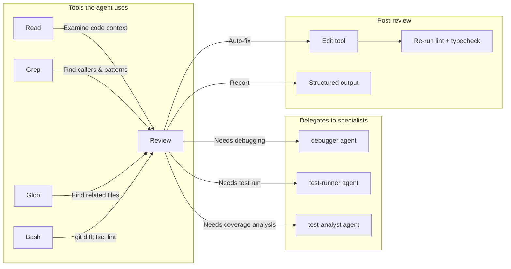

<div align="center">

# 🔍 Code Reviewer Agent

**Automated code review for TypeScript & React projects**

*A Claude Code subagent that reviews your code like a senior engineer, giving concrete fixes instead of vague suggestions*

[](https://docs.anthropic.com/en/docs/agents)
[]()
[]()
[](LICENSE)
[](https://t.me/codeonvibes)

[Installation](#-installation) · [Features](#-what-it-reviews) · [How It Works](#-how-it-works) · [Examples](#-example-output) · [Built On](#-built-on)

---

</div>

## 🎯 The Problem

You finish a feature, push the code, and get a review that says:

> *"Consider improving the error handling here."*

No specifics. No fix. No file path. You're left guessing what exactly to change. Or worse — the review nitpicks import order while missing a SQL injection on line 42.

## 💡 The Solution

**Code Reviewer Agent** is a `.md` file that configures Claude Code for expert-level code review. It gives you the exact fix: file, line, before → after.

```
src/api/userController.ts:42:critical: [Security] Raw user input in SQL query.
Fix: db.query('SELECT * FROM users WHERE id = $1', [userId])
```

Every finding has a severity, confidence level, and a concrete code change.

<div align="center">
<br>

<br>
<sub>What a review looks like — real findings, real fixes, no fluff</sub>
<br><br>
</div>

## ⚡ Why This Agent

<table>
<tr>
<td>

```
✅ 14 review categories
✅ 14 false-positive rules
✅ 4 severity levels + confidence
✅ Auto-fix with A/B/C/D options
✅ 0 dependencies, 0 config
✅ 1 file, copy and use
✅ Bilingual output (EN + RU)
✅ 8 refactoring heuristics
```

</td>
<td>

| Feature | This Agent | Manual Review | Generic AI |
|:--------|:----------:|:------------:|:----------:|
| Concrete fixes (file:line) | ✅ | ✅ | ❌ |
| Security (OWASP Top 10) | ✅ | ⚠️ sometimes | ❌ |
| False-positive filtering | ✅ | ✅ | ❌ |
| Auto-apply fixes | ✅ | ❌ | ❌ |
| Consistent across PRs | ✅ | ❌ | ⚠️ varies |
| Available at 3 AM | ✅ | ❌ | ✅ |
| Cost | Free | $150+/hr | Free |
| Setup time | 30 seconds | — | — |

</td>
</tr>
</table>

## ✨ What It Reviews

<table>
<tr>
<td width="50%" valign="top">

### Code Quality
- 🏗️ **Design & Architecture** — SOLID violations, layer leaks, wrong abstractions
- ✅ **Correctness** — edge cases, API contract mismatches, schema drift
- 🧩 **Complexity** — 11 code smells with thresholds (Fowler)
- 📝 **Naming** — Clean Code conventions
- 🔷 **TypeScript** — `any` hunting, type safety, discriminated unions

</td>
<td width="50%" valign="top">

### Reliability & Security
- ⚡ **Async & Concurrency** — race conditions, TOCTOU, N+1 queries
- 🔒 **Security** — OWASP Top 10, supply chain, CORS, headers
- 🚨 **Error Handling** — silent failures, missing boundaries
- ⚛️ **React Patterns** — hooks, stale closures, re-renders
- ♿ **Accessibility** — semantic HTML, ARIA, keyboard navigation

</td>
</tr>
<tr>
<td width="50%" valign="top">

### Testing & Data
- 🧪 **Test Quality** — coverage gaps, meaningful assertions
- 🗃️ **DB Migrations** — rollback safety, schema alignment
- 📦 **Performance** — bundle size, lazy loading, memoization

</td>
<td width="50%" valign="top">

### Developer Experience
- 📋 **Comments & Docs** — WHY not WHAT, no dead code
- 🗑️ **Removal Workflow** — safe deletion verification
- 🔄 **Refactoring Heuristics** — when to suggest vs. when to skip

</td>
</tr>
</table>

**14 review categories total.** The agent only checks what's relevant. Backend PR? It skips React and a11y. Test-only PR? It focuses on assertions and isolation.

## 📊 How It Works

```mermaid
flowchart TD
    A[📥 Receive diff] --> B{Classify PR type}
    B -->|Feature| C[All 14 categories]
    B -->|Bug fix| D[Correctness + Tests + Error Handling]
    B -->|Refactor| E[Design + Complexity + Naming + Tests]
    B -->|Test-only| F[Tests + Naming + Correctness]
    B -->|Deletion| G[🗑️ Removal Workflow]
    B -->|Migration| H[Rollback + Schema + Breaking changes]

    C & D & E & F & G & H --> I[Read surrounding code & callers]
    I --> J[Trace each finding: callers → tests → data flow]
    J --> K[Self-check: 10-point verification]
    K --> L{Verdict}

    L -->|0 Critical, 0 Warning| M[✅ Approve]
    L -->|0 Critical, 1-3 Warning| N[✅ Approve with suggestions]
    L -->|Any Critical or >3 Warning| O[🔄 Request Changes]
    L -->|Security / Data loss| P[🚫 Blocking]

    O & P --> Q[Present Action Options A/B/C/D]
    Q -->|A| R[Fix all findings automatically]
    Q -->|B| S[Fix Critical + Warning only]
    Q -->|C| T[Fix specific by number]
    Q -->|D| U[Review only, no auto-fix]
```



## 🎚️ Four Severity Levels

The key question: **"Can you describe a scenario where a real user is harmed?"**

| Level | Meaning | Example |
|:------|:--------|:--------|
| 🔴 **Critical** | Users **will** be affected. Immediate harm | SQL injection, missing auth check, data corruption |
| 🟡 **Warning** | Users **may** be affected under conditions | Missing useEffect cleanup, cognitive complexity >15 |
| 🔵 **Suggestion** | Dev experience issue. Code works but could be better | Extract shared logic, use discriminated unions |
| ⚪ **Nit** | Purely cosmetic | Better variable name, import order |

Each finding includes **confidence level**: `[HIGH]` (verified), `[MEDIUM]` (likely), `[LOW]` (suspicious).

## 📦 Installation

### 1. Copy the agent file

```bash
# Create agents directory if it doesn't exist
mkdir -p .claude/agents

# Download the agent
curl -o .claude/agents/code-reviewer.md \
  https://raw.githubusercontent.com/SomeStay07/code-review-agent/main/code-reviewer.md
```

### 2. Use it

```bash
# In Claude Code, say:
"Review my recent changes"
"Check this code before I push"
"глянь код, нет ли косяков?"
```

No configuration, API keys, or build step required.

> **Requirements:** [Claude Code](https://docs.anthropic.com/en/docs/claude-code) with subagent support. The agent runs on `sonnet` model by default.

## 📋 Example Output

```
## Code Review
**Scope:** 4 files, 187 lines | **Verdict:** Request Changes

### 🔴 Critical (must fix)
1. **[Correctness] [HIGH]** `src/services/orderService.ts` L42:
   Frontend expects `Order[]`, but API returns `{ data: Order[], total: number }`.
   Will crash at runtime.
   Fix: `const orders = response.data` (not `const orders = response`)

2. **[Security] [HIGH]** `src/api/userController.ts` L18:
   Raw user input in SQL query — SQL injection.
   Fix: `db.query('SELECT * FROM users WHERE id = $1', [userId])`

### 🟡 Warning
1. **[React] [MEDIUM]** `src/components/OrderList.tsx` L25:
   useEffect subscribes to eventBus but no cleanup. Memory leak on unmount.
   Fix: `return () => eventBus.unsubscribe(handler)`

### 🔵 Suggestion
1. **[TypeScript]** `src/types/order.ts` L8:
   String literal union → use discriminated union for exhaustive matching

### ⚪ Nit
1. **[Naming]** `src/services/orderService.ts` L12:
   `const d = new Date()` → `const createdAt = new Date()`

### ✅ Good
- Clean separation between API layer and business logic
- Proper use of discriminated unions for OrderStatus
- All new functions have descriptive names

### Next Steps
> Recommended: **A. Fix all** (2 Critical issues must be resolved before merge)
> - A. Fix all — auto-apply all fixes
> - B. Fix blocking — Critical + Warning only
> - C. Fix specific — choose by number
> - D. Review only — no auto-fix
```

## 🧠 Key Design Decisions

### "Review the diff, not the file"

The agent reviews only what changed, not the entire codebase. Pre-existing issues in unchanged code are out of scope. This follows [Google's Engineering Practices](https://google.github.io/eng-practices/review/): approve when the change improves overall code health, even if imperfect.

### "Investigate before judging"

Every finding is verified by reading the actual code. The agent uses `Grep` to find callers, `Read` to check implementations, and traces the data flow before writing a fix. A review based on assumptions breaks trust.

### Smart skipping

14 false-positive rules prevent noise: NestJS DI injection, `any` in tests, `as` assertions in mocks, barrel re-exports, root component `useEffect` cleanup, and more.

### Bilingual (EN + RU)

The agent detects the user's language and outputs the entire review in that language: headings, severity labels, and fixes. Code stays in the programming language.

## 🔧 Under the Hood



### Memory System

The agent has persistent memory across review sessions. It learns:
- Your project's coding conventions
- Recurring patterns and known false positives
- Team preferences not captured in config files

```
code-reviewer: team uses barrel re-exports → don't flag as dead code
code-reviewer: formatCurrency() required for all price display → flag raw .price access
```

### Refactoring Intelligence

Not every code smell warrants a suggestion. The agent uses **8 heuristics** to decide:

1. **Rule of Three** — tolerate duplication until the third occurrence
2. **Change frequency** — refactor hot spots, not stable code
3. **Blast radius** — >5 callers = separate task, not PR comment
4. **Behavior preservation** — no tests? Suggest tests first
5. **Incremental delivery** — never "rewrite the module"
6. **Wrong abstraction** — duplication > wrong abstraction (Sandi Metz)
7. **Test-first** — refactoring without tests is gambling
8. **Scope boundary** — refactoring belongs in a dedicated PR

## 📚 Built On

Built on practices from established industry sources:

| Source | What it contributes |
|:-------|:-------------------|
| [Google Engineering Practices](https://google.github.io/eng-practices/review/) | Review philosophy, severity calibration |
| Robert C. Martin — *Clean Code* | SOLID, naming, functions |
| Martin Fowler — *Refactoring* | 11 code smells with thresholds |
| Sandi Metz — *Practical OOP* | Wrong abstraction principle |
| Steve McConnell — *Code Complete* | Construction, defensive programming |
| [OWASP Top 10](https://owasp.org/www-project-top-ten/) | Security checklist |
| [Kent C. Dodds](https://kentcdodds.com/blog) | React patterns, hooks, testing |

## 🗂️ Repository Structure

```
code-review-agent/
├── assets/
│   └── demo.svg        # animated terminal demo
├── code-reviewer.md    # the agent (copy to .claude/agents/)
├── README.md
└── LICENSE
```

One file. No build step. No dependencies. Copy and use.

## 🏗️ Built For Production

This agent was built and refined while developing a real TypeScript + React + NestJS monorepo with 100+ files, a league system, gamification, and interview features. Every rule, false-positive filter, and refactoring heuristic comes from real-world review cycles.

> *700+ lines of review logic, refined through production use. Each rule comes from catching a real bug or preventing a false alarm.*

## 🤝 Contributing

1. Fork this repo
2. Edit `code-reviewer.md`
3. Test by placing it in your project's `.claude/agents/` directory
4. Submit a PR with a description of what changed and why

### Agent file structure

```
---
name: code-reviewer
description: |
  What the agent does.
  USE THIS AGENT WHEN: ...
  Technical triggers: ...
tools: Read, Grep, Glob, Bash, ...
model: sonnet
---

## Language Rule
## Core Principle
## Rules
## Review Process / Workflow
## Categories / Checks
## Severity Calibration
## Self-check
## Output Format
## Sources
```

## 📄 License

[MIT](LICENSE) — use it, modify it, ship it.

---

<div align="center">

**Built for developers who want concrete code reviews.**

*If this helped you, give it a ⭐ — it helps others find it too.*

</div>
